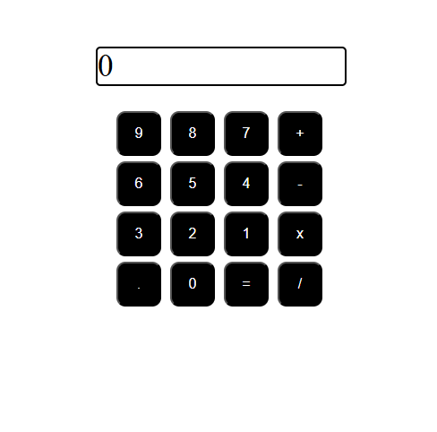

## Nombre: Sofía De Alessandre
## Link GitHub repositorio: https://github.com/SofiaDeAlessandre/calculadora-desafio-11.git
## Link Netlify: https://calculadora-desafio-11.netlify.app/

### Descripción: el desafío 11 se trata de una calculadora que permite hacer cálculos matemáticos, incluyendo números decimales. También, al hacer click en el display, se resetea a 0. 

